# military-expenditure-analysis-sipri
End-to-end Excel data analysis project using SIPRI military expenditure data: from raw data cleaning and duplicate removal to nested logical functions, cross-sheet VLOOKUP and pivot table reporting.
# Global Military Expenditure Analysis (SIPRI data)

> End-to-end data analysis project in Excel: from raw data cleaning to pivot table reporting.
> **Author:** Riccardo Pasquali · **Date:** July 2026

> **Note:** this project is a **training exercise**, built to practise and demonstrate
> core Excel data-analysis skills. The exercise was designed and carried out with the
> support of Claude (Anthropic's AI assistant), which prepared the practice dataset and
> guided the learning path; all the analysis steps, formulas and screenshots in this
> repository were performed by the author.
>
> *Screenshots were taken on an Italian localisation of Excel, so function names may
> appear in Italian (SE = IF, CERCA.VERT = VLOOKUP). Formulas in this document use the
> English names.*

##  Objective

Which world regions concentrate military spending? Do NATO members show a different
spending profile from non-members? And which countries increased their spending the
most between 2023 and 2024? This project answers these questions using Excel only 
demonstrating a complete analytical workflow: data cleaning, data enrichment through
logical and lookup functions, and aggregation with pivot tables.

##  Dataset

- **Source:** SIPRI Military Expenditure Database  https://www.sipri.org/databases/milex
- **Content:** military spending of 33 countries, years 2023–2024, in billions of
  current US dollars, with spending as a share of GDP
- **Methodological note:** the starting dataset was intentionally "dirtied"
  (duplicate rows, stray spaces, inconsistent naming and casing, numbers stored as
  text, missing values) to practise real-world data cleaning techniques. Figures are
  rounded and were checked against the official SIPRI database.

##  Phase 1-Data cleaning

The raw dataset contained 36 rows. After cleaning, 33 unique countries remained.
All cleaning was performed on a copy (`Clean_Data`), keeping the original
`Raw_Data` sheet untouched so the source remains verifiable at any time.

**Issues found in the raw data:**

| Issue | Where | How I fixed it |
|---|---|---|
| Trailing spaces in country names | 2 cells ("Japan ", "United States ") | Detected with `LEN` (length didn't match the visible text), removed with `TRIM` in a helper column, then pasted back as values |
| Inconsistent capitalisation | 2 cells ("germany", "United kingdom") | Fixed manually: only 2 cells were affected, and `PROPER` could produce unwanted results on multi-word names |
| Inconsistent country naming | 1 cell ("Holland" instead of "Netherlands") | Find & Replace, aligning the name to the lookup reference sheet |
| Numbers stored as text | 2 cells (China 2024, Turkey % GDP) | Detected with `ISNUMBER` and left-alignment as a visual clue; converted with "Convert to Number" |
| Missing values | 2 cells (Algeria 2023, Taiwan % GDP) | Left the cells empty rather than entering 0: a zero is data, an empty cell is absence of data, and a 0 would distort averages in the pivot tables |
| Duplicate rows | 3 rows (France, Poland, United States) | Data > Remove Duplicates, run **after** trimming spaces |

**Order of operations and why:**

I removed the spaces *before* removing duplicates. To Excel, "United States" and
"United States " are two different strings: running Remove Duplicates first would
have caught only 2 of the 3 duplicates, leaving a hidden one in the dataset. In
general, I standardised the text (spaces, casing, naming) first, so that every
subsequent operation deduplication, lookups, pivots worked on consistent keys.

**Raw data (before):**

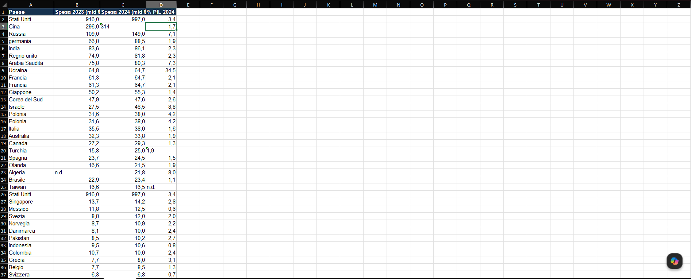

**Clean data (after):**

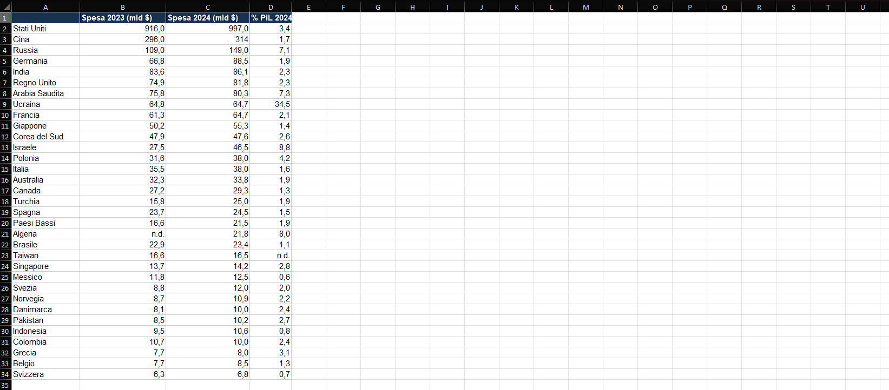

## Phase-2 Data organisation

The cleaned range was converted into a formatted Excel Table (Ctrl+T) named
**SpendTable**. This provides automatic filters, self-propagating formulas,
structured references (readable column names instead of cell coordinates) and a
dynamic source for the pivot tables. The table was sorted by 2024 spending in
descending order, the header row was frozen for scrolling, and number formats were
standardised (1 decimal for spending values, consistent % GDP display).

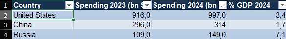

## Phase-3 New categories with logical functions

Three calculated columns turn raw numbers into analysable categories:

- **Trend** flags the year-on-year direction, including the edge case of
  unchanged spending:

  `=IF([@[Spending 2024 (bn $)]]>[@[Spending 2023 (bn $)]],"Increasing",IF([@[Spending 2024 (bn $)]]<[@[Spending 2023 (bn $)]],"Decreasing","Stable"))`

  

- **Spending Category** nested IF classifying countries as High (≥ $100bn),
  Medium (≥ $30bn) or Low. Thresholds are inclusive and chosen to isolate the three
  "great powers" (USA, China, Russia) in the top band while keeping the middle band
  large enough for meaningful comparison:

  `=IF([@[Spending 2024 (bn $)]]>=100,"High",IF([@[Spending 2024 (bn $)]]>=30,"Medium","Low"))`

  

- **% Change**  year-on-year variation, with `IFERROR` handling the country whose
  2023 figure is missing (Algeria), which would otherwise break the division:

  `=IFERROR(([@[Spending 2024 (bn $)]]-[@[Spending 2023 (bn $)]])/[@[Spending 2023 (bn $)]],"")`

**The calculated columns in the table:**

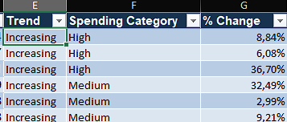

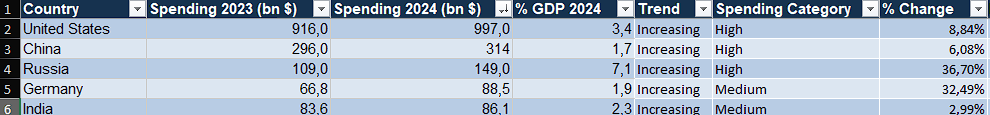

##  Phase-4  Nested logical formulas

The **Military Effort** column classifies the burden of military spending relative
to GDP. In its final version (see `sipri_analysis.xlsx`) it combines three
nesting levels plus an `AND`, and handles the missing value first  without that
guard, Excel's text-vs-number comparison rules would silently misclassify the
country with the missing figure:

```
=IF([@[% GDP 2024]]="","n/a",
  IF(AND([@[% GDP 2024]]>=5,[@Trend]="Increasing"),"High and growing effort",
    IF([@[% GDP 2024]]>=5,"High effort",
      IF([@[% GDP 2024]]>=2,"Medium effort","Low effort"))))
```

Sanity checks: Israel (8.8% of GDP, spending up 69%) → *High and growing effort*;
Ukraine (34.5% of GDP, slightly decreasing) → *High effort*; Switzerland (0.7%) →
*Low effort*; Taiwan (missing % GDP) → *n/a*.


## Phase-5 Cross-referencing data with VLOOKUP

The table was enriched with **Region**, **NATO membership** and **Continent** from
the `Countries_Registry` lookup sheet:

`=VLOOKUP([@Country],Countries_Registry!$A$1:$D$34,2,FALSE)` *(index 3 for NATO, 4 for Continent)*


The exact-match requirement (`FALSE`) doubles as a data-quality check: any name not
matching the registry returns an error which is how the "Holland" vs
"Netherlands" inconsistency was caught and fixed back in Phase 1.

A small verification dashboard below the table answers point questions on the
dataset:

- `=COUNTIF(SpendTable[NATO],"Yes")` → **15** NATO members (of 33 countries)
- `=MAX(SpendTable[% Change])` → **+69%**, the sharpest increase
- `=INDEX(SpendTable[Country],MATCH(MAX(SpendTable[% Change]),SpendTable[% Change],0))`
  → **Israel**  INDEX+MATCH is used here to overcome VLOOKUP's left-lookup
  limitation: the country name sits to the *left* of the value being searched.

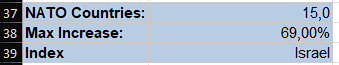

##  Phase-6  Analysis with pivot tables

All pivots are built on SpendTable, so they refresh automatically when the source
data changes.

**Pivot-1  Total spending by region**
*Setup:* Region in Rows, Spending 2024 in Values (Sum), sorted descending.
*Finding:* North America alone accounts for **$1,026bn** over 40% of the dataset
total of **$2,461bn** followed by East Asia ($433bn) and Western Europe ($375bn).
The top three regions concentrate roughly 75% of tracked spending.

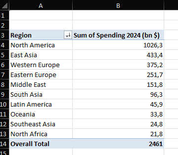

**Pivot-2 NATO vs non-NATO comparison**
*Setup:* NATO in Rows; in Values: Spending 2024 (Sum), % GDP 2024 (Average summing
GDP shares across countries would be meaningless), Country (Count).
*Finding:* the 15 NATO members outspend the 18 non-members in absolute terms
(**$1,458bn vs $1,003bn**), but non-NATO countries carry more than double the
relative burden (**avg 5.1% of GDP vs 2.2%**), driven by countries under active
conflict or regional tension (Ukraine 34.5%, Israel, Saudi Arabia, Algeria). Same
data, two metrics, two opposite rankings  the choice of metric shapes the story.

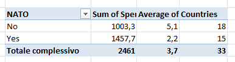

**Pivot-chart** regional totals as horizontal bars for immediate comparison.

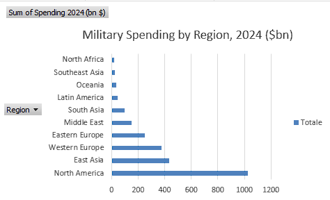

##  Key findings

1. **Global military spending is highly concentrated:** the top 3 regions account
   for ~75% of the $2,461bn tracked, and the top 3 countries (USA $997bn, China
   $314bn, Russia $149bn) alone for ~59%.
2. **Absolute and relative effort tell opposite stories:** NATO members dominate
   absolute spending ($1,458bn vs $1,003bn), but non-NATO countries sustain more
   than double the average GDP burden (5.1% vs 2.2%).
3. **Israel recorded the sharpest increase (+69% year-on-year)**, consistent with
   the escalation of the Middle East conflict in 2024  identified via INDEX+MATCH
   on the % Change column.
4. **2024 was a year of broad rearmament:** based on the Trend column, 28 of 33
   countries increased spending; Ukraine's burden of 34.5% of GDP remains an
   extreme outlier.
5. **Data quality caveat:** Algeria's 2023 figure is missing, so its year-on-year
   trend is not verifiable a documented example of how missing values propagate
   through calculated columns if not handled explicitly.

##  Skills demonstrated

- Data cleaning: TRIM, LEN for quality checks, duplicate handling, missing values,
  text-to-number conversion, Find & Replace normalisation
- Data organisation: formatted tables, structured references, freeze panes
- Logical functions: IF, nested IF, AND, IFERROR, edge-case handling
- Lookup functions: VLOOKUP across sheets, INDEX+MATCH for left-side lookups, COUNTIF
- Aggregation: pivot tables (sum, average, count), pivot charts
- Process documentation, reproducibility and source citation

- # 📊 Phase 2 — Interactive Excel Dashboard

## Goal

Phase 1 turned raw SIPRI data into a clean, enriched dataset. Phase 2 turns that dataset into a product --> a single interactive screen that answers the key questions about world military spending at a glance. The dashboard is designed for a non-technical reader, who can explore the data by clicking filters without touching a single formula.

## Dashboard preview

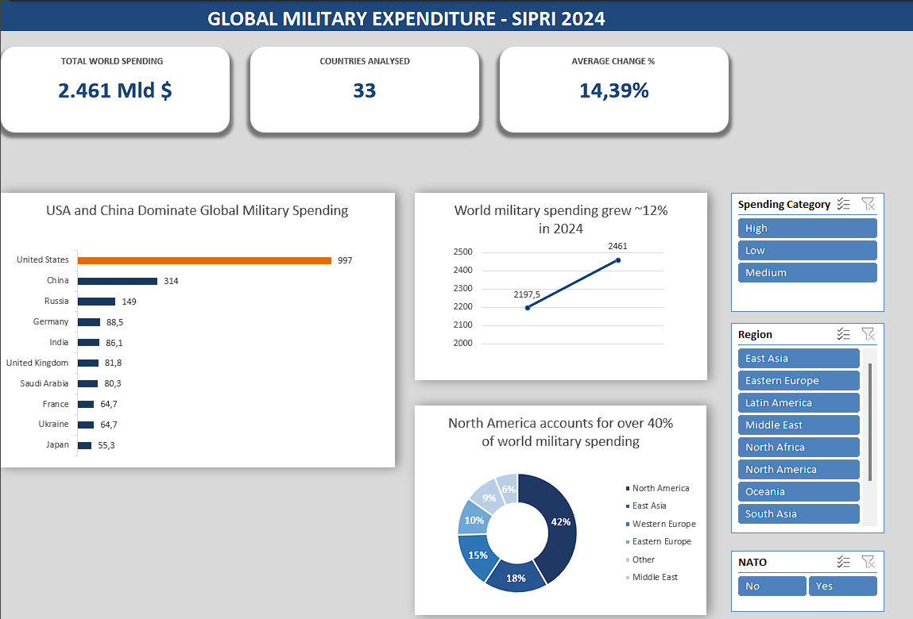

*Interactive filtering in action, Spending Category:High*

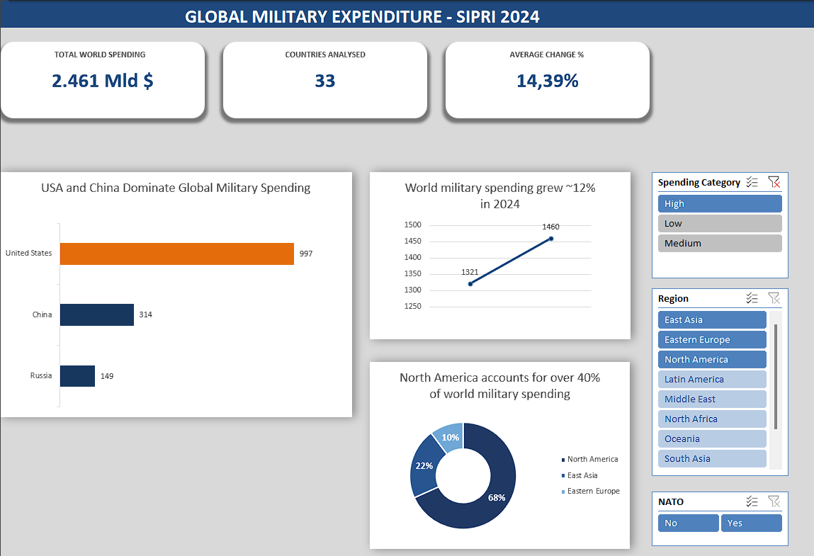

## Architecture

The workbook follows a 3-layer architecture, the same separation of concerns used by professional BI tools:

| Layer | Sheet | Role |
|---|---|---|
| Data | `Clean_Data` | Cleaned Excel Table from Phase 1, the single source of truth |
| Engine | `Pivot_Engine` | Dedicated, named pivot tables feeding the charts (hidden in the final file) |
| Presentation | `Dashboard` | Charts, KPI cards and slicers only. No raw numbers, no visible formulas |

## Techniques used

- **PivotCharts** powered by dedicated, named pivot tables (`pvt_top10`, `pvt_trend`, `pvt_region`), one pivot per chart
- **Slicers with multi-pivot Report Connections**: Region, Spending Category and NATO filters update all charts with one click
- **KPI cards built with cell-linked shapes**, showing live values computed with `SUM`, `COUNTA` and `AVERAGE` on the source table
- **Custom number formats** (e.g. `#,##0 "bn $"`) for compact headline numbers
- **Pivot grouping**: regions below ~4% of world spending merged into an "Other" category
- **Chart decluttering**: data labels instead of value axes, message-style titles, one accent colour for the key data point

## Key insights

- World military spending reached **$2,461bn in 2024**, up roughly **12%** year over year
- **North America accounts for about 42%** of world spending with only 2 of the 33 countries analysed
- The average country-level change is **+14.4%**, higher than the +12% total growth: smaller countries are increasing their budgets faster than the giants that dominate the total

## Design decisions

- **KPI cards show global totals** as a fixed reference point, while charts respond to slicer filters. The card formulas read the source table rather than the pivots, a known limit of this technique that was kept as a feature: filtered charts can always be compared against the world total.
- **Regions below ~4% were grouped into "Other"** to keep the doughnut chart readable (6 slices instead of 10). "Other" uses the lightest tone of the palette to signal a residual category.
- **One palette, one highlight**: navy for structure, greys for context, and a single orange accent reserved for the top spender in the ranking, so the reader's eye lands on the main message first.
- **Horizontal bars** for the Top 10 chart, because long country names stay readable that way.

## Lessons learned

- **Always validate the aggregation, not just the chart.** The regional doughnut initially displayed "Count of Spending Category" instead of "Sum of Spending 2024": it was counting countries per region rather than summing their spending. The chart looked perfectly plausible and told the opposite story, with Western Europe (12 countries, 15% of spending) appearing dominant instead of North America (2 countries, 42% of spending). Since then, checking that every pivot value field says "Sum of" and that grand totals reconcile with an independent calculation is part of my routine.
- **Excel dashboards have a structural interactivity ceiling.** Each slicer click recalculates the connected pivots one at a time, so charts redraw in sequence rather than simultaneously. This is one of the practical reasons professional interactive dashboards are built in dedicated BI tools, and it directly motivates the next step of this project.

---
*Data source: SIPRI Military Expenditure Database. All figures in constant US$ billions.*
